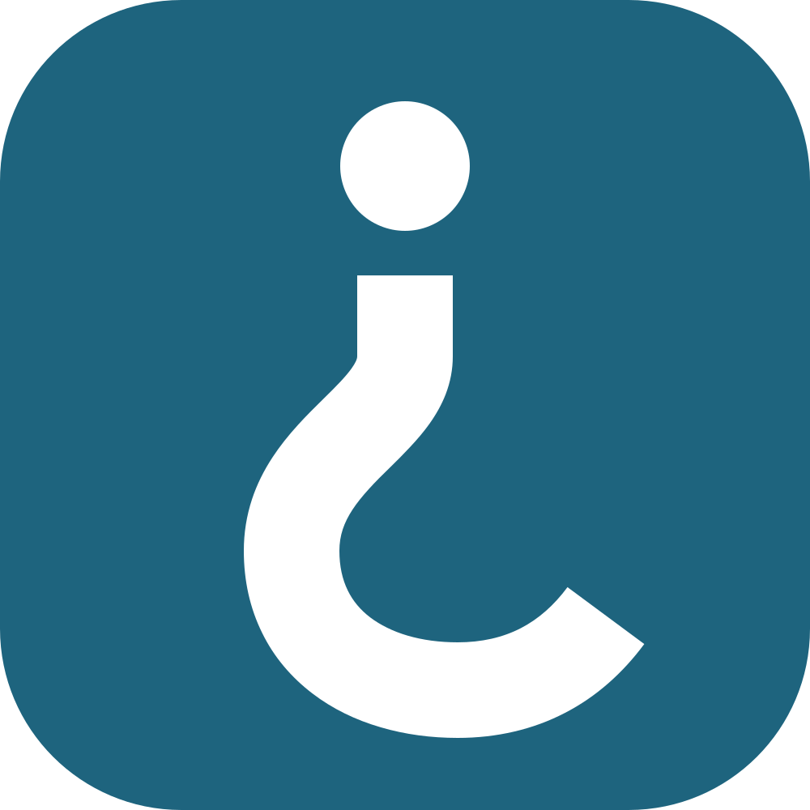
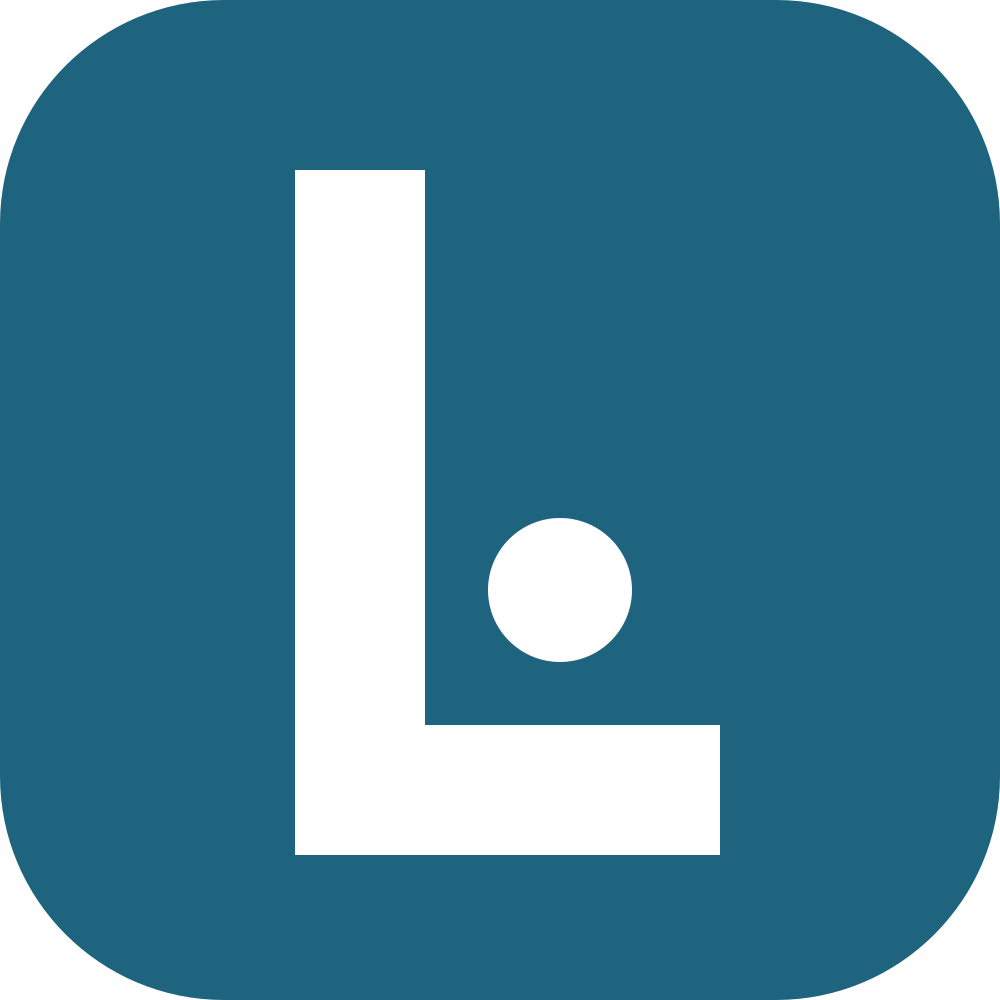
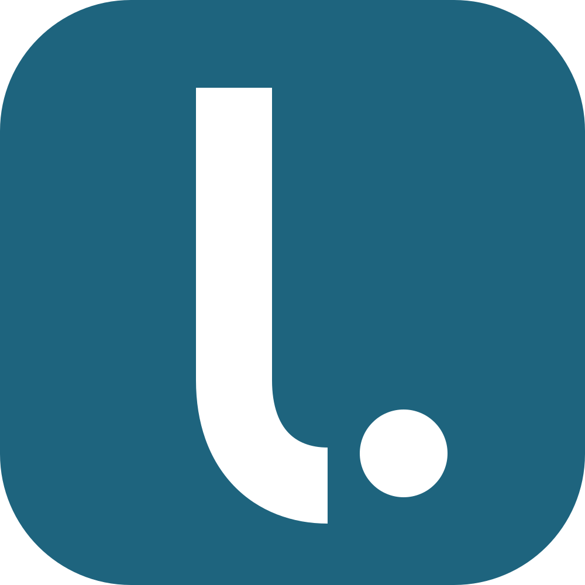

# Mark explorations

I drew eight concepts at icon size and checked each one at 1024, 120, 60, 40 and 29 px, on the light and dark accent. They were built in `source/explorations.py` and are kept here so the choice can be checked. None of them is an alternative to use.

| Concept | Idea | Verdict |
|---|---|---|
|  **A · Pregunta** | The Spanish opening question mark (¿), drawn as an L. Spanish-specific, and about asking. | **Rejected.** At every size it reads as a help or FAQ button, which suggests confusion. It also looks like a fishing hook. The Spanish angle survives in the voice instead. |
|  **B · Oído** | An L whose foot curls into the helix of an ear. | **Rejected.** It reads as a lowercase **b**. |
|  **C · Voz** | The loudness envelope of the spoken name: *lu* has a soft onset, *ca* and *ku* start with the burst of a /k/. | **Rejected.** It's phonetically honest, but a sharp front edge with a tapering tail reads as ▶ / ⏩, which is exactly the play-triangle cliché. |
|  **D · Respuesta** | An open listening form holding a point. | **Rejected.** It reads as © or a camera logo. |
|  **E1 · L + punto** | A square L with the point in its crook. | **Rejected.** Blunt, and it reads like the Catalan *l·l*. |
|  **E2 · Cuenco** | The L's foot cups upward like a hand to the ear, holding the point. | **Rejected.** It reads as a smiling face, or a **b** with an eye. |
|  **E3 · l + punto final** | A tailed lowercase l, then a full stop. | **Developed.** It's the only concept that stays unambiguous at 29 px, and it carries real meaning in Spanish (*en punto*, *al punto*). |
|  **E4 · Frase** | An L whose foot is one soft spoken undulation. | **Rejected.** It reads as **h** or a snake, and it drifts toward the soundwave cliché. |

## What changed between E3 and the final mark

- **Built from the wordmark.** The mark's l is the wordmark's l, with the same nib cut and tail, drawn heavier: stem 136 against a height of 600.
- **Bigger point.** The dot grew to 1.28 × the stem, so at 29 px it has the same visual weight as the stem.
- **Softer tail.** The inside of the tail was eased so the curve doesn't pinch at 1024.
- **A rejected tweak.** I tried a tail that lifts toward the point, as if handing it over. At 1024 the rising cut made a knife-like terminal, so I dropped it.
- **Two-tone tested.** I tried a light-blue (#74B9D1) point on the accent field. It lost contrast at home-screen size, and the point is the whole idea, so the default icon stays all white. Two-tone is used only on the dark icon, where the contrast holds.
